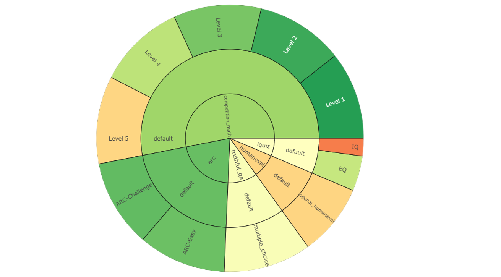
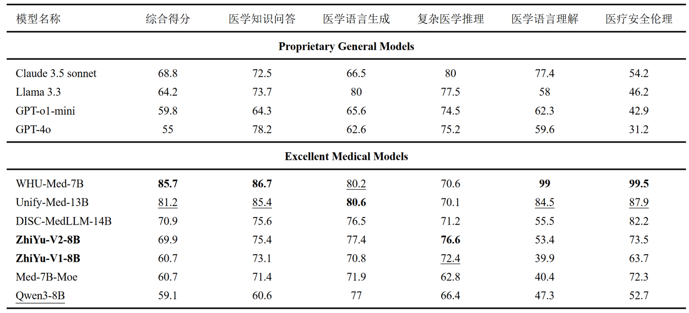
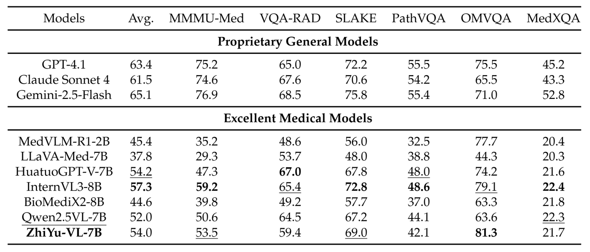

# 智渝（ZhiYu）

## 一款多模态大模型智能辅诊系统

### 项目完整流程

1. 基模选择：[Qwen3-8B](https://huggingface.co/Qwen/Qwen3-8B) 与 [Qwen2.5-VL-7B-Instruct](https://huggingface.co/Qwen/Qwen2.5-VL-7B-Instruct)
2. 数据收集与处理：将收集到的非结构化数据、结构化数据、高维数据以及时序数据等进行预处理，其中特别要注意一方面医疗数据与通识数据的比例恰当以防止模型灾难性遗忘，另一方面是带思维链与不带思维链数据的比例恰当以防止模型深度思考能力丧失。我们选用 Alpaca 格式用于模型微调，一共 80K 条数据，数据开源在 [CQULeaf/ZhiYu-8B-SFT](https://huggingface.co/datasets/CQULeaf/ZhiYu-8B-SFT)。
3. 模型微调：我们选用 Lora 技术进行微调，使用 LlamaFactory 辅助进行，其中核心参数为 benchsize=1, epoch=2, Learning rate=5e-5, lora rank=8。数小时训练结束后，我们保存LoRA adapter权重和分词器，并与基模型合并权重，最终保存为Safetensor格式，并开源在 [CQULeaf/ZhiYu](https://huggingface.co/CQULeaf/ZhiYu)。
4. 模型增强：我们在模型微调结束后，使用 GraphRAG 来使用知识图谱实现外接知识库的功能，同时使用 MCP 技术实现简单的联网搜索功能。
5. 模型评估：

   a. 模型通用能力评估

    

    b. 模型医疗专业能力评估（文本）

    

    c. 模型医疗专业能力评估（图像）

    
6. 模型应用：
为了方便使用，我们使用 Gradio 开发了 WebUI 界面，并将上述工作封装为 API 以供使用，WebUI开源在 [CQULeaf/llm-diagnosis-assistant-webui](https://github.com/CQULeaf/llm-diagnosis-assistant-webui)。

### 最后声明

该项目为学校实习任务，团队共五人用时半月左右完成，故可用性与专业度仍有很大提升空间，可作为学生初步接触学习大模型微调与应用参考使用。

### 相关链接

[模型应用WebUI部分](https://github.com/CQULeaf/llm-diagnosis-assistant-webui)